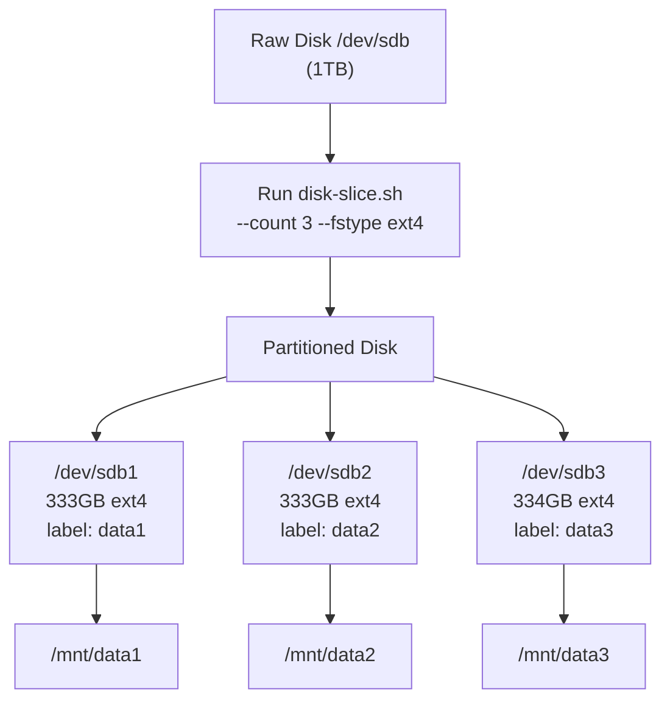
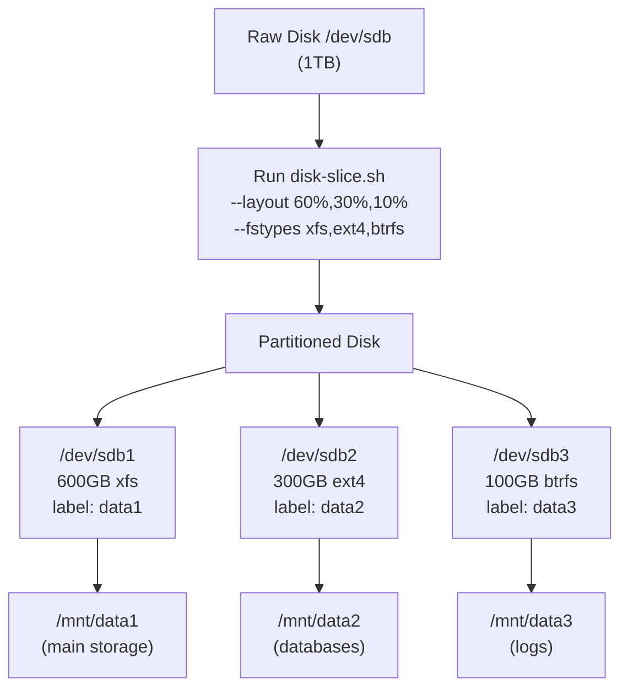

# disk-slice.sh

> ⚠️ **WARNING**: This tool creates a new partition table and will **destroy all existing data** on the target disk. Always verify you're targeting the correct disk and have backups of important data.

`disk-slice.sh` is a safe automation tool to **partition a new disk**, create filesystems, and generate `/etc/fstab` lines for mounting.

**Typical use case**: You add a new data disk to a VM and want to quickly carve it up into multiple partitions with filesystems and ready-to-use mountpoints.

## Quick Start

1. **Install dependencies** (see [Installation](#installation))
2. **Preview your plan** with dry-run:
   ```bash
   sudo ./disk-slice.sh --disk /dev/sdb --count 3 --fstype ext4 --dry-run
   ```
3. **Execute** when satisfied:
   ```bash
   sudo ./disk-slice.sh --disk /dev/sdb --count 3 --fstype ext4 --create-mounts
   ```

## Visual Overview

### Equal Partitions Example


### Custom Layout Example


## Features

- **Flexible Partitioning**:
  - N equal-size partitions: `--count 3`
  - Custom percentage layout: `--layout 50%,30%,20%`
- **Multi-Filesystem Support**:
  - Same FS type for all: `--fstype ext4`
  - Different FS per partition: `--fstypes ext4,xfs,btrfs`
- **Modern GPT Partitioning**:
  - Creates fresh GPT label with proper alignment
  - Automatic filesystem labels (`data1`, `data2`, ...)
- **fstab Integration**:
  - Generates UUID-based fstab entries
  - Written as commented file: `/root/fstab.new.<disk>.txt`
  - Review before adding to `/etc/fstab`
- **Convenience Options**:
  - `--create-mounts`: Create mountpoint directories
  - `--mount-now`: Mount filesystems immediately
- **Safety Features**:
  - Refuses to operate on disks in use
  - Interactive confirmation (unless `--yes`)
  - Dry-run mode to preview operations
  - Comprehensive validation checks

## Installation

### RHEL / Rocky / AlmaLinux
```bash
sudo dnf install -y gdisk util-linux e2fsprogs xfsprogs btrfs-progs parted
```

### Ubuntu / Debian
```bash
sudo apt update
sudo apt install -y gdisk util-linux e2fsprogs xfsprogs btrfs-progs parted
```

### Download Script
```bash
wget https://raw.githubusercontent.com/your-repo/disk-slice/main/disk-slice.sh
chmod +x disk-slice.sh
```

## Examples

### 1. Simple Storage Setup (3 Equal Partitions)
**Use case**: General file storage with equal space allocation
```bash
# Preview the plan
sudo ./disk-slice.sh --disk /dev/sdb --count 3 --fstype ext4 --dry-run

# Execute
sudo ./disk-slice.sh --disk /dev/sdb --count 3 --fstype ext4 --create-mounts --mount-now
```
**Result**: Three equal ext4 partitions mounted at `/mnt/data1`, `/mnt/data2`, `/mnt/data3`

### 2. Database Server Setup
**Use case**: Large data partition + smaller logs/temp partitions
```bash
sudo ./disk-slice.sh --disk /dev/sdb --layout 70%,20%,10% \
  --fstypes xfs,ext4,ext4 \
  --mount-base /srv/mysql \
  --create-mounts --mount-now
```
**Result**:
- `/srv/mysql1` (70%, xfs): Main database files
- `/srv/mysql2` (20%, ext4): Transaction logs
- `/srv/mysql3` (10%, ext4): Temporary files

### 3. Development Environment
**Use case**: Code, builds, and cache storage
```bash
sudo ./disk-slice.sh --disk /dev/nvme1n1 --layout 50%,30%,20% \
  --fstypes btrfs,ext4,xfs \
  --mount-base /opt/dev \
  --create-mounts
```
**Result**:
- `/opt/dev1` (50%, btrfs): Source code with snapshots
- `/opt/dev2` (30%, ext4): Build artifacts
- `/opt/dev3` (20%, xfs): Cache and temporary files

### 4. Media Server
**Use case**: Large media storage + metadata
```bash
sudo ./disk-slice.sh --disk /dev/sdc --layout 90%,10% \
  --fstypes xfs,ext4 \
  --label-prefix media \
  --mount-base /srv/media \
  --mount-now
```
**Result**:
- `/srv/media1` (90%, xfs): Video/photo files
- `/srv/media2` (10%, ext4): Metadata and thumbnails

### 5. Backup Storage
**Use case**: Multiple backup destinations
```bash
sudo ./disk-slice.sh --disk /dev/sdd --count 4 --fstype btrfs \
  --label-prefix backup \
  --mount-base /backup \
  --create-mounts
```
**Result**: Four equal btrfs partitions for different backup types

### 6. Container Storage
**Use case**: Docker/Podman with separate overlay and volume storage
```bash
sudo ./disk-slice.sh --disk /dev/sde --layout 60%,40% \
  --fstypes overlay2,xfs \
  --mount-base /var/lib/containers \
  --create-mounts
```

## Command Reference

### Required Parameters
- `--disk /dev/SDX`: Target disk device (e.g., `/dev/sdb`, `/dev/nvme1n1`)
- **One of**:
  - `--count N`: Number of equal-size partitions
  - `--layout A%,B%,C%`: Comma-separated percentages (must sum to 100)
- **Filesystem choice**:
  - `--fstype TYPE`: Single filesystem type for all partitions
  - `--fstypes TYPE1,TYPE2,TYPE3`: Per-partition filesystem types

### Optional Parameters
- `--label-prefix NAME`: Filesystem label prefix (default: `data`)
- `--mount-base PATH`: Base directory for mountpoints (default: `/mnt/data`)
- `--create-mounts`: Create mountpoint directories
- `--mount-now`: Mount filesystems immediately (implies `--create-mounts`)
- `--use-parted`: Use `parted` instead of `sgdisk`
- `--align-mib N`: Partition alignment in MiB (default: 1)
- `-y, --yes`: Skip confirmation prompt
- `-n, --dry-run`: Preview operations without making changes
- `-v, --verbose`: Enable verbose logging
- `-h, --help`: Show help message

## Safety and Best Practices

### Before Running
- [ ] **Verify target disk**: Use `lsblk` to confirm disk device name
- [ ] **Check for existing data**: Ensure the disk contains no important data
- [ ] **Backup critical data**: Always have backups before partitioning
- [ ] **Test with dry-run**: Always preview with `--dry-run` first
- [ ] **Confirm disk size**: Verify the disk is the expected size

### Disk Identification
```bash
# List all disks
lsblk

# Show detailed disk information
sudo fdisk -l

# Check if disk is in use
sudo findmnt | grep /dev/sdb
```

### Safety Features
The script includes multiple safety checks:
- Refuses to operate on mounted disks
- Validates disk is a whole disk device
- Checks for existing filesystem signatures
- Detects LVM physical volumes
- Requires interactive confirmation
- Supports dry-run mode for preview

## Troubleshooting

### Common Issues

**Error: "disk is not a whole disk"**
- Ensure you're targeting a whole disk (`/dev/sdb`) not a partition (`/dev/sdb1`)
- Use `lsblk` to verify disk type

**Error: "disk appears to be mounted"**
- Unmount any mounted partitions: `sudo umount /dev/sdb*`
- Check for swap usage: `sudo swapoff /dev/sdb*`

**Error: "has existing signatures"**
- The disk has existing filesystems or partition tables
- Use `sudo wipefs -a /dev/sdb` to clear (DESTRUCTIVE)

**Permission denied errors**
- Script requires root privileges
- Run with `sudo` or as root user

**Partition creation fails**
- Check disk health: `sudo smartctl -a /dev/sdb`
- Verify sufficient disk space for requested layout
- Try different alignment: `--align-mib 2`

### Getting Help
```bash
# Show all available options
./disk-slice.sh --help

# Preview operations without changes
sudo ./disk-slice.sh --disk /dev/sdb --count 3 --fstype ext4 --dry-run --verbose
```

## FAQ

**Q: When should I use this tool vs other partitioning tools?**
A: Use `disk-slice.sh` when you need to quickly partition a new disk with filesystems and mountpoints. Use `fdisk`/`parted` for more complex partitioning needs or when working with existing partition tables.

**Q: Can I use this on an existing disk with data?**
A: No. This tool creates a fresh GPT partition table, destroying all existing data. It's designed for new, empty disks only.

**Q: What filesystem types are supported?**
A: Currently supports `ext4`, `ext3`, `xfs`, and `btrfs`. The script checks for required tools before proceeding.

**Q: Can I modify partitions after creation?**
A: The script doesn't support modifying existing partitions. You'd need to use other tools like `parted`, `resize2fs`, etc.

**Q: Is it safe to interrupt the script?**
A: If interrupted during partition creation or formatting, you may have a partially configured disk. Use dry-run mode to preview operations first.

**Q: How do I add the fstab entries?**
A: Review the generated file at `/root/fstab.new.<disk>.txt`, then uncomment and append entries to `/etc/fstab` manually.

## Contributing

### Testing
- Test with various disk sizes and partition counts
- Verify on different Linux distributions
- Test both equal-size and percentage layouts
- Always use virtual machines for testing

### Reporting Issues
When reporting issues, include:
- Linux distribution and version
- Disk type and size
- Complete command used
- Error messages
- Output of `lsblk` and `sudo fdisk -l`

---

**License**: MIT | **Author**: Hamkee | **Version**: 1.0.0
